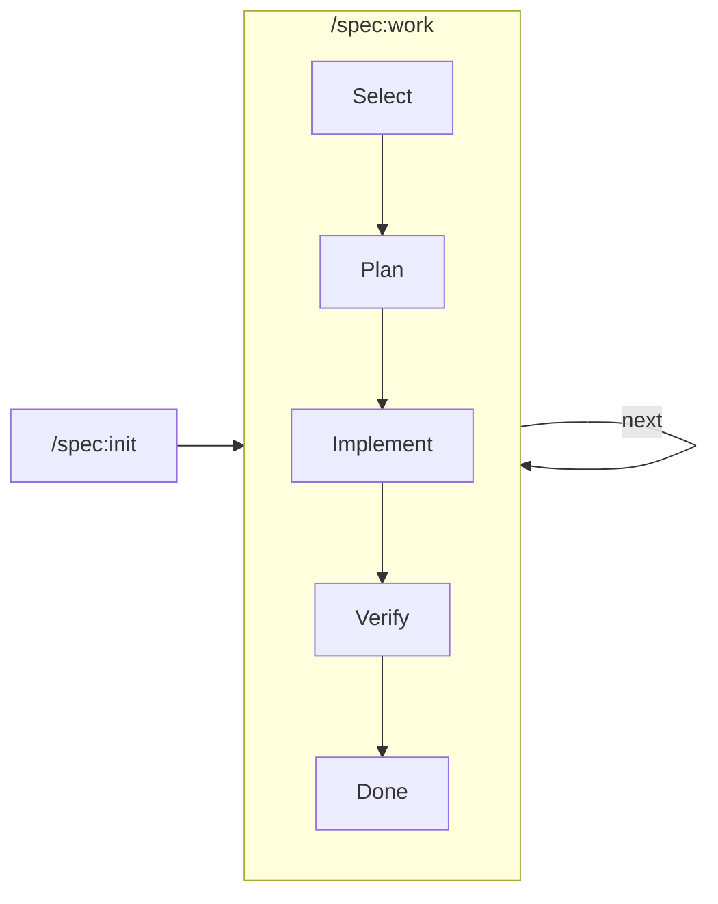

# Claude Code Complete Guide

Comprehensive reference for commands, agents, skills, hooks.

---

## Architecture Overview

### Command Flow

```mermaid
flowchart LR
    User[User] --> Command[/command]
    Command --> Skill{Skill}
    Skill --> Agent[Agent]
    Agent --> Tool[Tool/CLI]
    Tool --> Summary[Summary]
    Summary --> User
```

---

## Commands

### Spec-Driven (`/spec:*`) - 5 Commands

| Command        | Verb   | Purpose                                  |
| -------------- | ------ | ---------------------------------------- |
| `/spec:init`   | START  | Initialize project or add reqs from docs |
| `/spec:work`   | DO     | Main workflow - select, plan, implement  |
| `/spec:status` | SEE    | Progress overview with optional flags    |
| `/spec:new`    | CREATE | Create new task or requirement           |
| `/spec:done`   | FINISH | Mark complete with optional discovery    |

#### Status Flags

```bash
/spec:status                    # overview
/spec:status TASK-xxx           # show specific task + linked req
/spec:status --list             # all tasks
/spec:status --todo             # pending only
/spec:status --check            # quality audit
```

#### Done Flags

```bash
/spec:done TASK-xxx             # mark specific task
/spec:done --discover           # find potentially done tasks
/spec:done --verify TASK-xxx    # run tests before marking
```

### Other Commands

| Command         | Description                       |
| --------------- | --------------------------------- |
| `/test:e2e`     | E2E testing with Playwright       |
| `/test:improve` | Improve test quality              |
| `/agent:resume` | Resume a previously spawned agent |
| `/ai:consult`   | Independent review from Claude    |
| `/learn`        | Extract session learnings         |

---

## Agents

### Language Engineers

| Agent                 | Model | Focus                              |
| --------------------- | ----- | ---------------------------------- |
| `go-engineer`         | opus  | Go development, clean architecture |
| `python-engineer`     | opus  | Python development, type safety    |
| `typescript-engineer` | opus  | TypeScript, React, strict typing   |

### Language Specialists (Deep Review)

**Go**: `go-qa`, `go-tests`, `go-impl`, `go-idioms`, `go-docs`, `go-simplify`
**Python**: `py-qa`, `py-tests`, `py-impl`, `py-idioms`, `py-docs`, `py-simplify`
**TypeScript**: `ts-qa`, `ts-tests`, `ts-impl`, `ts-idioms`, `ts-docs`, `ts-simplify`
**Web**: `web-qa`, `web-tests`, `web-impl`, `web-idioms`, `web-docs`, `web-simplify`

### Spec-Driven Agent

| Agent          | Model  | Focus                        |
| -------------- | ------ | ---------------------------- |
| `spec-planner` | sonnet | Creates implementation plans |

### Infrastructure & Utility

| Agent                   | Model  | Focus                                |
| ----------------------- | ------ | ------------------------------------ |
| `infra-engineer`        | opus   | K8s, Terraform, Helm, GitHub Actions |
| `docs-keeper`           | sonnet | Documentation maintenance            |
| `playwright-tester`     | opus   | E2E browser testing                  |
| `perplexity-researcher` | haiku  | Web research                         |

---

## Skills

### User-Invocable

| Skill                 | Triggers On                        |
| --------------------- | ---------------------------------- |
| `brainstorming-ideas` | "brainstorm", "design", "explore"  |
| `fixing-code`         | "fix", "fix issues", "fix errors"  |
| `reviewing-code`      | "review", "review code"            |
| `committing-code`     | "commit", "save changes"           |
| `documenting-code`    | "update docs", "document"          |
| `checking-deploy`     | "deploy check", "validate k8s"     |
| `looking-up-docs`     | Library documentation via Context7 |
| `researching-web`     | "research", "compare X vs Y"       |

### Auto-Activated

| Skill                | Triggers When         |
| -------------------- | --------------------- |
| `writing-go`         | Go code development   |
| `writing-python`     | Python code           |
| `writing-typescript` | TypeScript code       |
| `writing-web`        | HTML/CSS/JS/HTMX      |
| `managing-infra`     | K8s, Terraform, CI/CD |
| `refactoring-code`   | Batch refactoring     |
| `searching-code`     | Codebase exploration  |

---

## Hooks

| Hook                | Event            | Purpose                   |
| ------------------- | ---------------- | ------------------------- |
| `session-start.sh`  | SessionStart     | Project context on start  |
| `skill-enforcer.sh` | UserPromptSubmit | Suggests relevant skills  |
| `file-protector.sh` | PreToolUse       | Protects sensitive files  |
| `smart-lint.sh`     | PostToolUse      | Auto-lints modified files |

---

## Spec-Driven Development

### Structure

```
.spec/
├── PROGRESS.md     # Session state (auto-managed, last 5 entries)
├── tasks/          # TASK-*.md (HOW - implementation)
└── reqs/           # REQ-*.md (WHAT - requirements)
```

**Task Status:** `todo` or `done` (delete if obsolete)

### Abstraction Levels

| Location       | Level | Should Contain   | Should NOT Contain |
| -------------- | ----- | ---------------- | ------------------ |
| `.spec/reqs/`  | WHAT  | Success criteria | File paths, code   |
| `.spec/tasks/` | HOW   | Implementation   | Business rationale |

### Workflow



### PROGRESS.md

Auto-managed session state:

```
14:32 SELECT TASK-auth-login
14:35 PLAN TASK-auth-login
14:36 BRANCH task/TASK-auth-login
14:52 IMPL TASK-auth-login
14:55 DONE TASK-auth-login
```

Kept lean: auto-truncates to last 5 entries.

---

## File Structure

```
~/.claude/
├── README.md           # Overview
├── GUIDE.md            # This file
├── CLAUDE.md           # Instructions
├── agents/             # Agent definitions
├── commands/           # Slash commands
├── skills/             # Domain knowledge
├── hooks/              # Event handlers
└── scripts/            # Helpers
```
