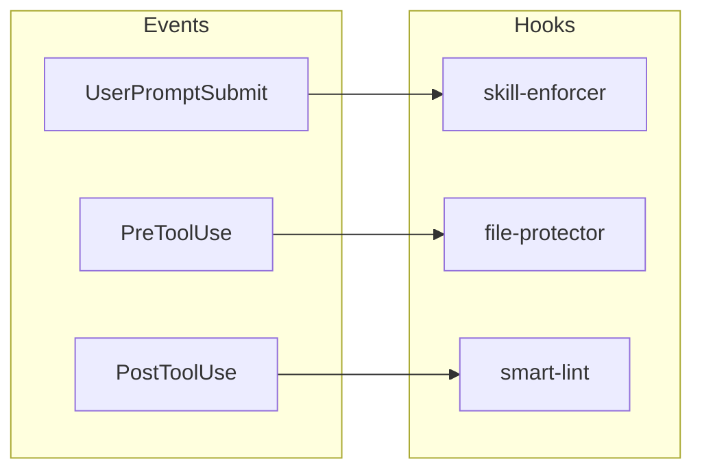
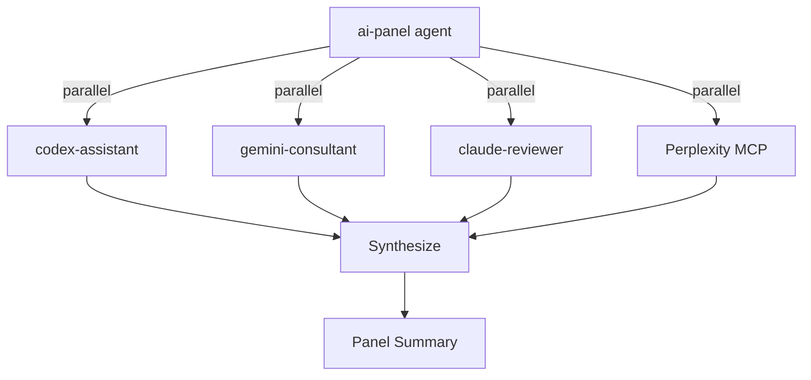
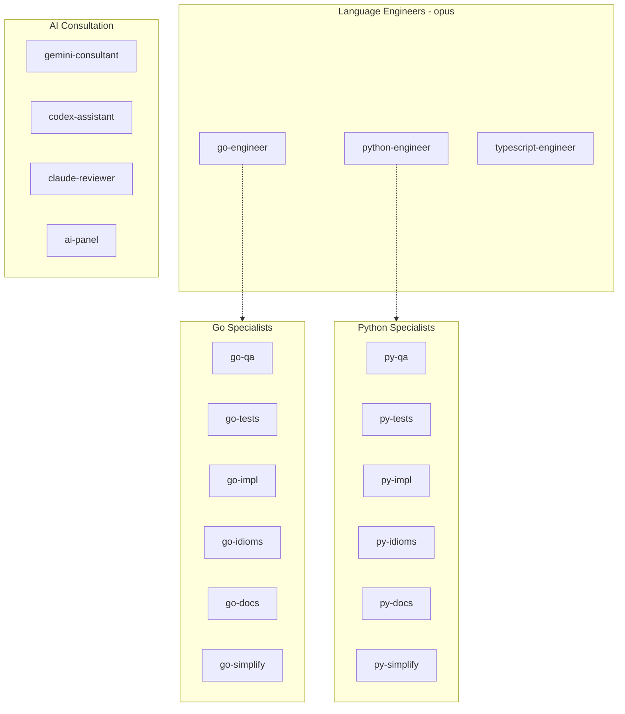
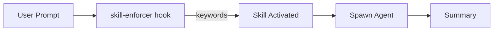
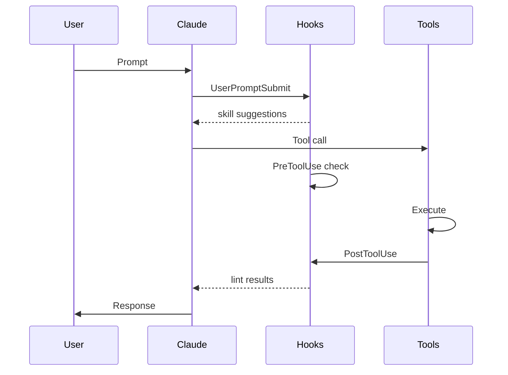

# Claude Code Complete Guide

Comprehensive reference for commands, agents, skills, hooks, and scripts.

---

## Table of Contents

- [Architecture Overview](#architecture-overview)
- [Commands](#commands)
- [Agents](#agents)
- [Skills](#skills)
- [Hooks](#hooks)
- [Scripts](#scripts)
- [MCP Integration](#mcp-integration)
- [Workflows](#workflows)

---

## Architecture Overview

### Command Flow

```mermaid
flowchart LR
    User[User] --> Command[/command]
    Command --> Skill{Skill<br/>WHEN}
    Skill --> Agent[Agent<br/>HOW]
    Agent --> Tool[Tool/CLI]
    Tool --> Summary[Summary]
    Summary --> User
```

### AI Consultation Architecture

```mermaid
flowchart TB
    subgraph Command
        AC[/ai:consult]
    end

    subgraph Agents
        GC[gemini-consultant]
        CA[codex-assistant]
        CR[claude-reviewer]
        APA[ai-panel]
    end

    subgraph External
        Gemini[Gemini CLI]
        Codex[Codex CLI]
        Perp[Perplexity MCP]
    end

    AC --> |gemini| GC --> Gemini
    AC --> |codex| CA --> Codex
    AC --> |panel| APA
    APA --> GC
    APA --> CA
    APA --> CR
    APA --> Perp
```

### Hook System



---

## Commands

### Code Quality (`/code:*`)

| Command              | Description                        | Example                            |
| -------------------- | ---------------------------------- | ---------------------------------- |
| `/code:fix`          | Zero-tolerance quality enforcement | `/code:fix`                        |
| `/code:review`       | Multi-agent code review            | `/code:review deep external`       |
| `/code:consult`      | Codex consultation                 | `/code:consult review "auth flow"` |
| `/code:docs`         | Documentation updates              | `/code:docs`                       |
| `/code:deploy-check` | K8s/CI validation                  | `/code:deploy-check`               |
| `/code:commit`       | Smart commit grouping              | `/code:commit`                     |

#### `/code:review` Modes

```bash
/code:review                 # Language engineers only
/code:review deep            # 6-12 specialized sub-agents
/code:review external        # Engineers + Codex + Gemini
/code:review deep external   # All sub-agents + external AI
```

#### `/code:consult` Modes

```bash
/code:consult "question"           # General consultation
/code:consult review "topic"       # Code review mode
/code:consult plan "feature"       # Implementation planning
```

### AI Consultation (`/ai:consult`)

Unified command for all AI consultation needs.

| Mode                     | Description                | Example                                     |
| ------------------------ | -------------------------- | ------------------------------------------- |
| `/ai:consult gemini`     | Gemini architecture advice | `/ai:consult gemini "Redis vs Memcached"`   |
| `/ai:consult codex`      | Codex code review          | `/ai:consult codex "review auth flow"`      |
| `/ai:consult panel`      | 4-perspective consultation | `/ai:consult panel "gRPC vs REST?"`         |
| `/ai:consult brainstorm` | Gemini brainstorming       | `/ai:consult brainstorm "caching strategy"` |
| `/ai:consult compare`    | Systematic comparison      | `/ai:consult compare "A vs B"`              |

#### `/ai:consult panel` Flow



### Testing (`/test:*`)

| Command          | Description                             |
| ---------------- | --------------------------------------- |
| `/test:coverage` | 80% minimum coverage enforcement        |
| `/test:generate` | Generate tests following best practices |

### Spec-Driven (`/spec:*`)

| Command        | Description                      |
| -------------- | -------------------------------- |
| `/spec:init`   | Initialize feature specification |
| `/spec:gen`    | Generate from specification      |
| `/spec:work`   | Continue spec-driven work        |
| `/spec:status` | Check implementation progress    |
| `/spec:sync`   | Sync feature list from code      |

### Other Commands

| Command        | Description                 |
| -------------- | --------------------------- |
| `/docs:lookup` | Library docs via Context7   |
| `/research`    | Web research via Perplexity |

---

## Agents

### Agent Hierarchy



### Language Engineers

| Agent                 | Model | Focus                              |
| --------------------- | ----- | ---------------------------------- |
| `go-engineer`         | opus  | Go development, clean architecture |
| `python-engineer`     | opus  | Python development, type safety    |
| `typescript-engineer` | opus  | TypeScript, React, strict typing   |

### Language Specialists (Deep Review)

**Go Specialists:**

| Agent         | Focus                                |
| ------------- | ------------------------------------ |
| `go-qa`       | Logic, security (OWASP), performance |
| `go-tests`    | Test quality, table-driven tests     |
| `go-impl`     | Requirements, DI, edge cases         |
| `go-idioms`   | Patterns, error handling, stdlib     |
| `go-docs`     | Documentation, comments              |
| `go-simplify` | Over-abstraction, dead code          |

**Python Specialists:**

| Agent         | Focus                        |
| ------------- | ---------------------------- |
| `py-qa`       | Logic, security, performance |
| `py-tests`    | pytest, fixtures, coverage   |
| `py-impl`     | Requirements, DI, edge cases |
| `py-idioms`   | PEP8, type hints, Protocols  |
| `py-docs`     | Docstrings, README           |
| `py-simplify` | Over-abstraction, dead code  |

**TypeScript Specialists:**

| Agent      | Focus                         |
| ---------- | ----------------------------- |
| `ts-tests` | Vitest, React Testing Library |
| `ts-docs`  | JSDoc, TSDoc, comments        |

### Infrastructure & Docs

| Agent            | Model  | Focus                                |
| ---------------- | ------ | ------------------------------------ |
| `infra-engineer` | opus   | K8s, Terraform, Helm, GitHub Actions |
| `docs-keeper`    | opus   | Documentation maintenance            |
| `pdf-parser`     | sonnet | PDF extraction and analysis          |

### AI Consultation Agents

| Agent               | Model  | Purpose                     |
| ------------------- | ------ | --------------------------- |
| `gemini-consultant` | haiku  | Architecture via Gemini CLI |
| `codex-assistant`   | haiku  | Code review via Codex CLI   |
| `claude-reviewer`   | sonnet | Fresh Claude perspective    |
| `ai-panel`          | sonnet | Orchestrates 4 perspectives |

---

## Skills

Skills provide domain knowledge and trigger conditions.



### Available Skills

| Skill                 | Triggers When                    |
| --------------------- | -------------------------------- |
| `asking-gemini`       | Architecture, design, trade-offs |
| `asking-codex`        | Code review, implementation help |
| `looking-up-docs`     | Library documentation needed     |
| `researching-web`     | Current info, best practices     |
| `writing-go`          | Go development                   |
| `writing-python`      | Python development               |
| `writing-typescript`  | TypeScript development           |
| `managing-infra`      | K8s, Terraform, CI/CD            |
| `using-cloud-cli`     | GCP, AWS CLI operations          |
| `using-git-worktrees` | Parallel development             |

---

## Hooks

### Hook Flow



### Active Hooks

| Hook                | Event            | Purpose                   |
| ------------------- | ---------------- | ------------------------- |
| `skill-enforcer.sh` | UserPromptSubmit | Suggests relevant skills  |
| `file-protector.sh` | PreToolUse       | Protects sensitive files  |
| `smart-lint.sh`     | PostToolUse      | Auto-lints modified files |
| `notify.sh`         | Notification     | Desktop notifications     |

### smart-lint.sh

Auto-detects and lints:

| Language      | Tools                |
| ------------- | -------------------- |
| Go            | golangci-lint, gofmt |
| TypeScript/JS | prettier, eslint     |
| Python        | ruff, black, mypy    |
| YAML          | yamllint             |
| Shell         | shellcheck           |
| K8s           | kubeval, actionlint  |

---

## Scripts

### copilot-proxy.sh

Rate limit fallback using GitHub Copilot API.

```bash
~/.claude/scripts/copilot-proxy.sh           # Start
~/.claude/scripts/copilot-proxy.sh --status  # Check
~/.claude/scripts/copilot-proxy.sh --stop    # Stop
```

### CLI Wrappers

| Script         | Location                              |
| -------------- | ------------------------------------- |
| Gemini wrapper | `skills/asking-gemini/scripts/ask.sh` |
| Codex wrapper  | `skills/asking-codex/scripts/ask.sh`  |

---

## MCP Integration

| Server                | Purpose               |
| --------------------- | --------------------- |
| `sequential-thinking` | Multi-step reasoning  |
| `context7`            | Library documentation |
| `perplexity-ask`      | Web research          |

---

## Workflows

### Feature Development

```mermaid
flowchart LR
    A[Design] --> B[Panel] --> C[Implement] --> D[Review] --> E[Commit]

    A -.- A1[/ai:consult gemini]
    B -.- B1[/ai:consult panel]
    D -.- D1[/code:review]
    E -.- E1[/code:commit]
```

```bash
/ai:consult brainstorm "caching strategy"
/ai:consult panel "Redis vs Memcached"
# implement...
/code:review deep external
/code:commit
```

### Quick Quality

```bash
/code:fix  # Zero tolerance
```

### Pre-deployment

```bash
/code:deploy-check
```

---

## File Structure

```
~/.claude/
├── README.md           # Overview
├── GUIDE.md            # This file
├── CLAUDE.md           # Instructions
├── agents/             # Agent definitions
├── commands/           # Slash commands
├── skills/             # Domain knowledge
├── hooks/              # Event handlers
└── scripts/            # Helpers
```
