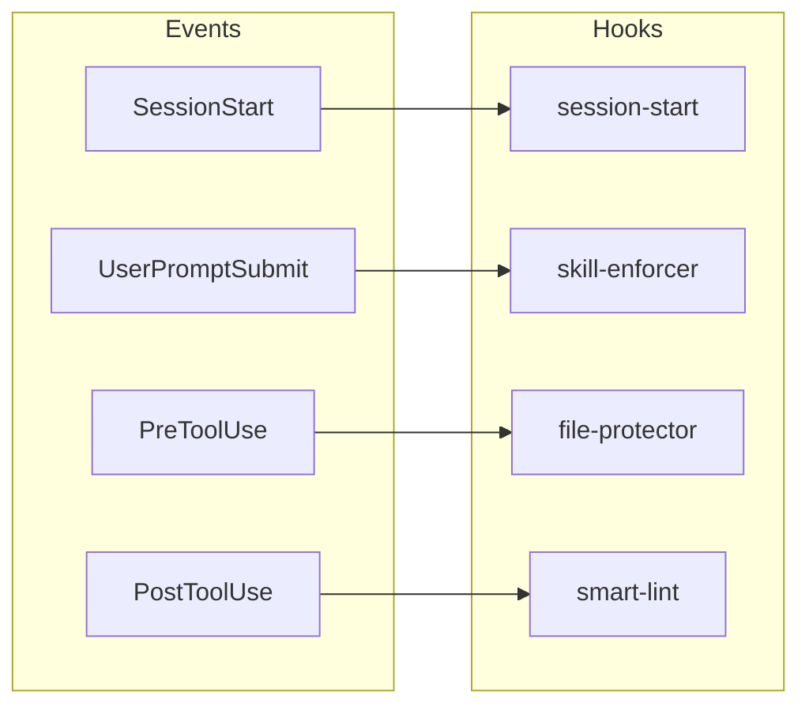
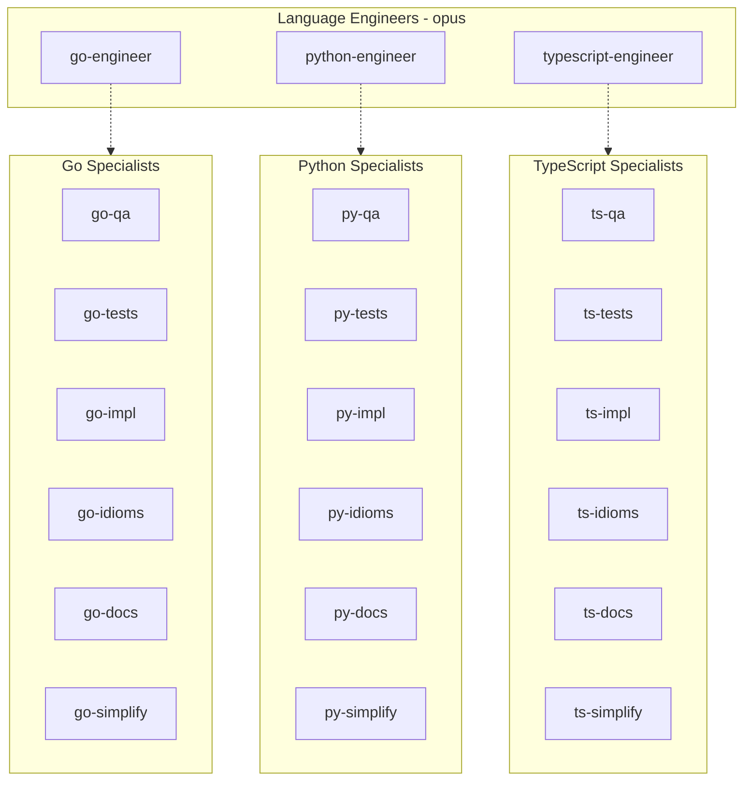
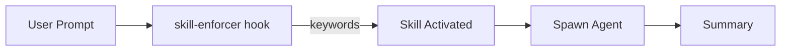
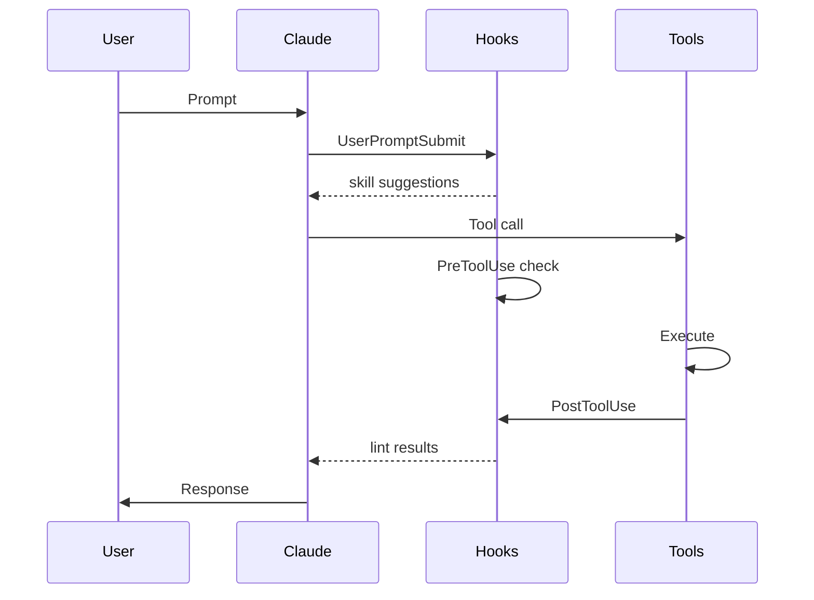
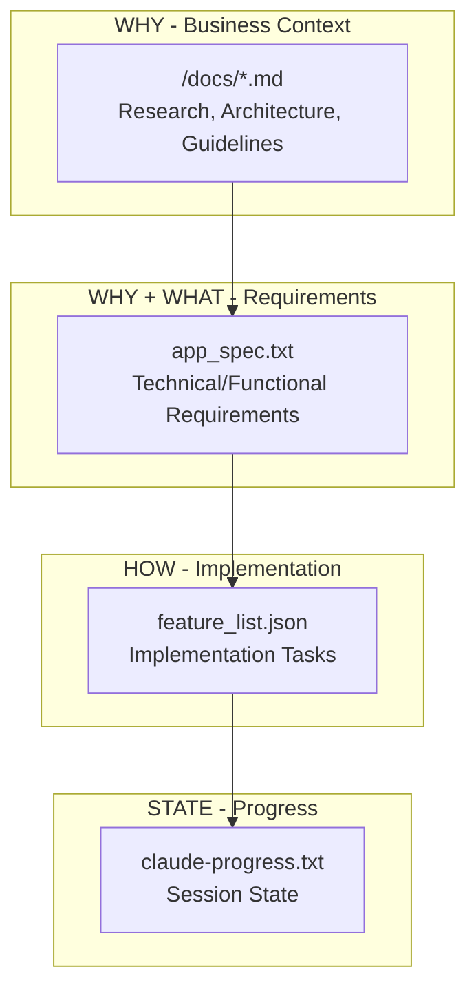
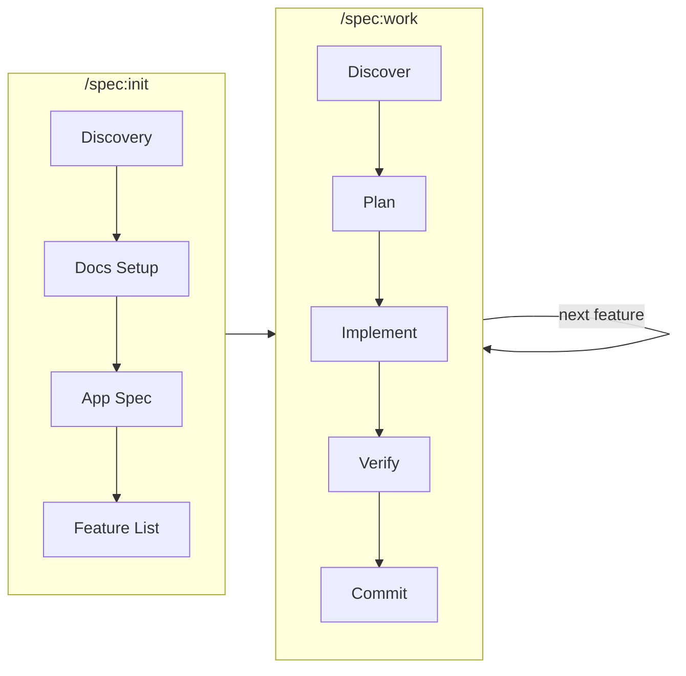

# Claude Code Complete Guide

Comprehensive reference for commands, agents, skills, hooks, and scripts.

---

## Table of Contents

- [Architecture Overview](#architecture-overview)
- [Commands](#commands)
- [Agents](#agents)
- [Skills](#skills)
- [Hooks](#hooks)
- [Scripts](#scripts)
- [MCP Integration](#mcp-integration)
- [Spec-Driven Development](#spec-driven-development)
- [Workflows](#workflows)

---

## Architecture Overview

### Command Flow

```mermaid
flowchart LR
    User[User] --> Command[/command]
    Command --> Skill{Skill<br/>WHEN}
    Skill --> Agent[Agent<br/>HOW]
    Agent --> Tool[Tool/CLI]
    Tool --> Summary[Summary]
    Summary --> User
```

### Hook System



---

## Master-Clone Pattern

**Key insight from Anthropic research**: Don't create highly specialized "expert" subagents. They're brittle and often underperform.

### The Pattern

Instead of creating custom specialists, **clone the main agent with a focused prompt**:

```
Main Agent (full capabilities)
    ├── Clone + "Review this Go code for security issues"
    ├── Clone + "Implement this feature following existing patterns"
    └── Clone + "Research best practices for X"
```

### Why It Works

1. **Same capabilities** - Clones inherit all tools, skills, and context
2. **Focused attention** - Narrow prompt = focused output
3. **No brittleness** - No custom logic that can break
4. **Parallel execution** - Multiple clones work simultaneously

### Implementation

Your engineer agents (`go-engineer`, `python-engineer`, `typescript-engineer`) follow this pattern:

```yaml
model: opus # Same powerful model
tools: [Read, Bash, Grep, Glob, ...] # Analysis tools (NO Edit/Write)
skills: [writing-go, looking-up-docs, ...] # Skill inheritance
---
You are an Expert Go Engineer... # Focused prompt

## Output Mode: Propose Only
Return structured proposals for main context to apply.
```

They analyze and propose changes but **do not apply edits directly**. This ensures:

- User approval for each edit
- No autonomous changes bypassing the approval loop
- Clean separation: subagents explore, main context implements

### When to Use Subagents

| Scenario               | Approach                         |
| ---------------------- | -------------------------------- |
| Deep code analysis     | Clone with analysis prompt       |
| Parallel exploration   | Multiple clones, different areas |
| Feature implementation | Engineer agent (focused clone)   |
| Research task          | Researcher agent (focused clone) |
| Simple lookup          | Direct MCP tool call (no agent)  |

### Anti-Patterns to Avoid

1. **Over-specialized agents** - Agent that only does one narrow thing
2. **Custom tool restrictions** - Limiting tools "for safety" often backfires
3. **Chained agents** - Agent A calls Agent B calls Agent C (fragile)
4. **Stateful agents** - Agents that need to remember across invocations

---

## Skill vs Agent vs Command

| Component   | When to Use                  | Context Impact            |
| ----------- | ---------------------------- | ------------------------- |
| **Skill**   | Inject knowledge/patterns    | Loaded on-demand, minimal |
| **Agent**   | Parallel work, deep analysis | Separate context window   |
| **Command** | User-invoked workflows       | Orchestrates agents/tools |

---

## Commands

### Code Quality (`/code:*`)

| Command              | Description                        | Example              |
| -------------------- | ---------------------------------- | -------------------- |
| `/code:fix`          | Zero-tolerance quality enforcement | `/code:fix`          |
| `/code:review`       | Multi-agent code review            | `/code:review deep`  |
| `/code:docs`         | Documentation updates              | `/code:docs`         |
| `/code:deploy-check` | K8s/CI validation                  | `/code:deploy-check` |
| `/code:commit`       | Smart commit grouping              | `/code:commit`       |

#### `/code:review` Modes

```bash
/code:review                 # Language engineers only
/code:review deep            # 6-12 specialized sub-agents
```

### Testing (`/test:*`)

| Command         | Description                 |
| --------------- | --------------------------- |
| `/test:e2e`     | E2E testing with Playwright |
| `/test:improve` | Improve test quality        |

### Spec-Driven (`/spec:*`)

| Command        | Description                      |
| -------------- | -------------------------------- |
| `/spec:init`   | Initialize feature specification |
| `/spec:gen`    | Generate from specification      |
| `/spec:work`   | Continue spec-driven work        |
| `/spec:status` | Check implementation progress    |
| `/spec:sync`   | Sync feature list from code      |

### Agent Management (`/agent:*`)

| Command         | Description                       | Example                 |
| --------------- | --------------------------------- | ----------------------- |
| `/agent:resume` | Resume a previously spawned agent | `/agent:resume a3c6662` |

### AI Assistance (`/ai:*`)

| Command       | Description                               | Example               |
| ------------- | ----------------------------------------- | --------------------- |
| `/ai:consult` | Independent review from fresh perspective | `/ai:consult auth.go` |

### Other Commands

| Command        | Description                           |
| -------------- | ------------------------------------- |
| `/docs:lookup` | Library docs via Context7             |
| `/research`    | Web research via Perplexity           |
| `/learn`       | Extract session learnings → CLAUDE.md |

---

## Agents

### Agent Hierarchy



### Language Engineers

| Agent                 | Model | Focus                              |
| --------------------- | ----- | ---------------------------------- |
| `go-engineer`         | opus  | Go development, clean architecture |
| `python-engineer`     | opus  | Python development, type safety    |
| `typescript-engineer` | opus  | TypeScript, React, strict typing   |

### Language Specialists (Deep Review)

**Go Specialists:**

| Agent         | Focus                                |
| ------------- | ------------------------------------ |
| `go-qa`       | Logic, security (OWASP), performance |
| `go-tests`    | Test quality, table-driven tests     |
| `go-impl`     | Requirements, DI, edge cases         |
| `go-idioms`   | Patterns, error handling, stdlib     |
| `go-docs`     | Documentation, comments              |
| `go-simplify` | Over-abstraction, dead code          |

**Python Specialists:**

| Agent         | Focus                        |
| ------------- | ---------------------------- |
| `py-qa`       | Logic, security, performance |
| `py-tests`    | pytest, fixtures, coverage   |
| `py-impl`     | Requirements, DI, edge cases |
| `py-idioms`   | PEP8, type hints, Protocols  |
| `py-docs`     | Docstrings, README           |
| `py-simplify` | Over-abstraction, dead code  |

**TypeScript Specialists:**

| Agent         | Focus                                |
| ------------- | ------------------------------------ |
| `ts-qa`       | Logic, security (OWASP), performance |
| `ts-tests`    | Vitest, React Testing Library        |
| `ts-impl`     | Requirements, DI, edge cases         |
| `ts-idioms`   | Strict types, modern patterns        |
| `ts-docs`     | JSDoc, TSDoc, comments               |
| `ts-simplify` | Over-abstraction, dead code          |

### Spec-Driven Agents

| Agent           | Focus                                |
| --------------- | ------------------------------------ |
| `spec-discover` | Project discovery, progress tracking |
| `spec-planner`  | Implementation planning from specs   |
| `spec-verifier` | Feature verification against specs   |

### Infrastructure & Utility

| Agent                   | Model  | Focus                                |
| ----------------------- | ------ | ------------------------------------ |
| `infra-engineer`        | opus   | K8s, Terraform, Helm, GitHub Actions |
| `docs-keeper`           | sonnet | Documentation maintenance            |
| `pdf-parser`            | haiku  | PDF extraction and analysis          |
| `playwright-tester`     | opus   | E2E browser testing                  |
| `perplexity-researcher` | haiku  | Web research                         |

---

## Skills

Skills provide domain knowledge and trigger conditions.



### Available Skills

| Skill                 | Triggers When           |
| --------------------- | ----------------------- |
| `writing-go`          | Go development          |
| `writing-python`      | Python development      |
| `writing-typescript`  | TypeScript development  |
| `looking-up-docs`     | Library documentation   |
| `researching-web`     | Web research            |
| `searching-code`      | Codebase exploration    |
| `refactoring-code`    | Batch refactoring       |
| `managing-infra`      | K8s, Terraform, CI/CD   |
| `using-cloud-cli`     | GCP, AWS CLI operations |
| `using-git-worktrees` | Parallel development    |
| `using-modern-cli`    | Modern CLI tools        |
| `testing-e2e`         | Playwright testing      |

---

## Hooks

### Hook Flow



### Active Hooks

| Hook                | Event            | Purpose                   |
| ------------------- | ---------------- | ------------------------- |
| `session-start.sh`  | SessionStart     | Project context on start  |
| `skill-enforcer.sh` | UserPromptSubmit | Suggests relevant skills  |
| `file-protector.sh` | PreToolUse       | Protects sensitive files  |
| `smart-lint.sh`     | PostToolUse      | Auto-lints modified files |
| `notify.sh`         | Notification     | Desktop notifications     |

### Configuration

Hooks read from `~/.claude/hook-config.json` for easy customization:

```json
{
  "fileProtector": { "protectedPatterns": [...] },
  "smartLint": { "excludePatterns": [...] },
  "performanceMonitor": { "contextWarningThreshold": 0.10 }
}
```

### smart-lint.sh

Auto-detects and lints:

| Language      | Tools                |
| ------------- | -------------------- |
| Go            | golangci-lint, gofmt |
| TypeScript/JS | prettier, eslint     |
| Python        | ruff, black, mypy    |
| YAML          | yamllint             |
| Shell         | shellcheck           |
| K8s           | kubeval, actionlint  |

---

## Scripts

### copilot-proxy.sh

Rate limit fallback using GitHub Copilot API.

```bash
~/.claude/scripts/copilot-proxy.sh           # Start
~/.claude/scripts/copilot-proxy.sh --status  # Check
~/.claude/scripts/copilot-proxy.sh --stop    # Stop
```

---

## MCP Integration

| Server                | Purpose                   |
| --------------------- | ------------------------- |
| `sequential-thinking` | Multi-step reasoning      |
| `context7`            | Library documentation     |
| `perplexity-ask`      | Web research              |
| `playwright`          | E2E browser testing       |
| `morphllm`            | Fast editing, code search |

---

## Spec-Driven Development

A structured approach for building features from specifications with full traceability.

### Documentation Hierarchy



| Document              | Focus      | Contains                                      |
| --------------------- | ---------- | --------------------------------------------- |
| `/docs/*.md`          | WHY        | Research, architecture, guidelines, decisions |
| `app_spec.txt`        | WHY + WHAT | Technical/functional requirements             |
| `feature_list.json`   | HOW        | Implementation tasks (references app_spec)    |
| `claude-progress.txt` | STATE      | Current session progress                      |

**Key principle:** Read top-down for context. Requirements (WHY/WHAT) go in `app_spec.txt`, implementation details (HOW) go in `feature_list.json`.

### Workflow



### Commands

| Command        | Purpose                                                      |
| -------------- | ------------------------------------------------------------ |
| `/spec:init`   | Initialize project with docs, spec, and feature list         |
| `/spec:gen`    | Generate `app_spec.txt` from markdown documents              |
| `/spec:work`   | Main development loop (discover → plan → implement → verify) |
| `/spec:status` | Quick progress check                                         |
| `/spec:sync`   | Reconcile tracking files with actual code state (top-down)   |
| `/spec:align`  | Align spec with code implementation (bottom-up)              |
| `/spec:audit`  | Audit spec documents for abstraction level violations        |

### Agents

| Agent           | Role                                                   |
| --------------- | ------------------------------------------------------ |
| `spec-discover` | Reads all docs top-down, returns structured summary    |
| `spec-planner`  | Creates implementation plan from architectural context |
| `spec-verifier` | Verifies feature against spec steps                    |
| `spec-aligner`  | Discovers code features, proposes spec updates         |
| `spec-auditor`  | Classifies content by abstraction level (WHY/WHAT/HOW) |

### Typical Session

```bash
# Session 1: Initialize
/spec:init
# → Creates docs/, app_spec.txt, feature_list.json

# Session 2+: Implement features
/spec:work
# → Discovery → Planning → Implementation → Verification → Commit

# Check progress anytime
/spec:status

# After interrupted session
/spec:sync
```

### Recovery Workflow (after ad-hoc development)

```bash
# 1. Discover code not in spec
/spec:align
# → Adds missing features, marks orphans as deprecated

# 2. Check abstraction levels
/spec:audit
# → Reports WHY/WHAT/HOW misplacements

# 3. Manual fixes based on audit report

# 4. Verify implementation status
/spec:sync

# 5. Resume normal development
/spec:work
```

### Feature List Format

```json
[
  {
    "category": "core",
    "description": "User can log in with email and password",
    "steps": [
      "Create login form with email/password fields",
      "Validate credentials against database",
      "Return JWT token on success"
    ],
    "passes": false
  }
]
```

**Rules:**

- Feature descriptions are immutable after init
- Only modify `"passes"` field: `false` → `true`
- Never mark passing until build/test/lint all pass

---

## Workflows

### Feature Development

```mermaid
flowchart LR
    A[Design] --> B[Implement] --> C[Review] --> D[Commit]

    C -.- C1[/code:review]
    D -.- D1[/code:commit]
```

```bash
# implement...
/code:review deep
/code:commit
```

### Quick Quality

```bash
/code:fix  # Zero tolerance
```

### Pre-deployment

```bash
/code:deploy-check
```

---

## File Structure

```
~/.claude/
├── README.md           # Overview
├── GUIDE.md            # This file
├── CLAUDE.md           # Instructions
├── agents/             # Agent definitions
├── commands/           # Slash commands
├── skills/             # Domain knowledge
├── hooks/              # Event handlers
└── scripts/            # Helpers
```
