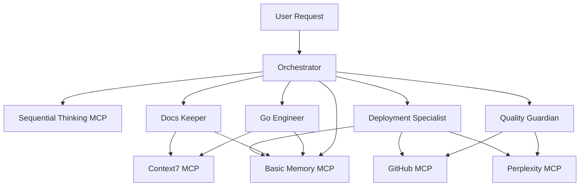

# Claude Code Agent Configuration

A streamlined, production-ready agent system for Go development with clean architecture focus, security-conscious practices, and efficient MCP integration. Features 5 specialized agents optimized for concise, focused interactions.

## Architecture Overview



## Agent Specializations

### 🎯 **Orchestrator** (Sonnet)
**Central coordinator for complex tasks**
- Plans multi-step workflows using sequential-thinking
- Manages project memory and context preservation
- Delegates to specialist agents based on requirements
- Ensures validation checkpoints with user

### 🔧 **Go Engineer** (Sonnet)
**Go development specialist**
- Clean architecture implementation
- Standard library preference and Go idioms
- Microservices and CLI tool development
- Performance-conscious design patterns

### 🛡️ **Quality Guardian** (Opus)
**Testing, security, and code review specialist**
- Comprehensive test creation with testify/mockery
- Security analysis with OWASP patterns
- Code quality enforcement (80% coverage minimum)
- Performance analysis and benchmarking

### 📚 **Docs Keeper** (Haiku)
**Documentation and knowledge management**
- GoDoc generation and maintenance
- README and architecture documentation
- API documentation with OpenAPI specs
- Mermaid diagrams for system architecture

### 🚀 **Deployment Specialist** (Sonnet)
**Infrastructure and deployment automation**
- Kubernetes manifests with security-first approach
- GitHub Actions workflows and CI/CD
- Simple infrastructure as code patterns
- Security-conscious deployment practices

## MCP Server Integration

### 🧠 **Sequential Thinking**
Complex planning and architectural decision making
- Multi-step analysis for complex problems
- Architectural trade-off evaluation
- Risk assessment and mitigation planning

### 🔍 **Perplexity**
AI research buddy for updated information
- Latest Go security practices and vulnerabilities
- Performance optimization techniques
- Infrastructure and deployment best practices

### 📖 **Context7**
Up-to-date library documentation
- Go standard library references
- Third-party framework documentation
- API specification standards

### 💾 **Basic Memory**
Project continuity and knowledge management
- Architecture decisions and patterns
- Coding conventions and standards
- Performance baselines and lessons learned

### 🔗 **GitHub**
Repository and workflow management
- Pull request analysis and reviews
- GitHub Actions automation
- Repository management and branching

## Setup Guide

### Prerequisites

- Node.js (for MCP servers)
- Python 3.8+ (for basic-memory)
- Go 1.21+ (for development)

### 1. Install MCP Servers

```bash
# Install Node.js MCP servers
npm install -g @modelcontextprotocol/server-github
npm install -g @modelcontextprotocol/server-sequential-thinking
npm install -g @upstash/context7-mcp

# Install Python MCP server
pip install basic-memory

# Install Perplexity MCP server
npm install -g server-perplexity-ask
```

### 2. Configure API Keys

Update your global `.claude.json` with API keys:

```json
{
  "mcpServers": {
    "perplexity-ask": {
      "env": {
        "PERPLEXITY_API_KEY": "your-perplexity-api-key"
      }
    },
    "github": {
      "env": {
        "GITHUB_PERSONAL_ACCESS_TOKEN": "your-github-token"
      }
    }
  }
}
```

### 3. Create Memory Directory

```bash
mkdir -p ~/.claude/memory
```

### 4. Install Required Development Tools

The smart-lint hook requires various linters and formatters. Install them using Homebrew:

#### Go Development
```bash
# gofmt is included with Go installation
go install github.com/golangci/golangci-lint/cmd/golangci-lint@latest
```
**golangci-lint** - Fast Go linters aggregator with 40+ linters for comprehensive code quality checking.

#### TypeScript/JavaScript
```bash
npm install -g prettier eslint
```
**prettier** - Opinionated code formatter that enforces consistent style across your codebase.  
**eslint** - JavaScript/TypeScript linter that identifies and reports patterns for code quality.

#### Python
```bash
brew install black ruff
# Alternative: pip install black ruff
```
**black** - Uncompromising Python code formatter that eliminates style debates.  
**ruff** - Extremely fast Python linter written in Rust, replacing flake8 and many others.

#### YAML/JSON
```bash
brew install yq jq yamllint
```
**yq** - YAML processor for formatting and manipulation (you already have this).  
**yamllint** - YAML linter for syntax and style validation, especially useful for K8s manifests.  
**jq** - Command-line JSON processor for formatting and validation.

#### Shell/Bash
```bash
brew install shellcheck shfmt
```
**shellcheck** - Static analysis tool for shell scripts that finds bugs and suggests improvements.  
**shfmt** - Shell script formatter that maintains consistent styling across bash scripts.

#### GitHub Actions
```bash
brew install actionlint
```
**actionlint** - Static checker for GitHub Actions workflows that validates syntax and best practices.

#### Terraform
```bash
brew install terraform tflint
```
**terraform** - Infrastructure as code tool with built-in formatting and validation.  
**tflint** - Terraform linter that finds possible errors and enforces best practices.

#### Markdown
```bash
npm install -g prettier markdownlint-cli2
# Alternative formatter: pip install mdformat
```
**prettier** - Code formatter with excellent markdown support including frontmatter and mermaid preservation.  
**markdownlint-cli2** - Markdown linter for GitHub-flavored markdown with support for frontmatter and mermaid blocks.  
**mdformat** (alternative) - Python-based markdown formatter with plugin support for GFM, frontmatter, and mermaid.

#### Kubernetes/Helm (Optional)
```bash
brew install kubeval helm
```
**kubeval** - Kubernetes manifest validator that checks against official schemas.  
**helm** - Kubernetes package manager with built-in chart linting capabilities.

### 5. Verify Configuration

```bash
# Check MCP servers are working
claude mcp

# Verify agents are loaded
ls ~/.claude/agents/

# Test commands
/orchestrate "test the system setup"

# Test linting tools
$HOME/.claude/hooks/smart-lint.sh --debug
```

## Usage Patterns

### 🚀 **Complex Development Tasks**
```bash
/orchestrate "Implement user authentication with JWT tokens and refresh mechanism"
```

### 🔍 **Code Review Process**
```bash
/review  # Comprehensive pre-commit review
```

### 📊 **Quality Assurance**
```bash
/test-coverage  # Enforce 80% minimum coverage
```

### 📖 **Documentation Updates**
```bash
/docs  # Update all project documentation
```

### 🛠️ **Testing Setup**
```bash
/gen-mocks  # Generate mockery mocks for interfaces
```

### 🚀 **Deployment Validation**
```bash
/deploy-check  # Validate K8s manifests and CI/CD
```

### 💾 **Knowledge Preservation**
```bash
/remember "Key architectural decision or pattern"
```

## Quality Standards

### Security Requirements
- ✅ Non-root container execution
- ✅ Read-only root filesystems
- ✅ Network policies and resource limits
- ✅ Secrets management best practices
- ✅ OWASP compliance validation

### Code Quality Gates
- ✅ 80% minimum test coverage
- ✅ Go vet and linting passing
- ✅ Security vulnerability scanning
- ✅ Performance regression testing
- ✅ Documentation completeness

### Infrastructure Standards
- ✅ Kubernetes security contexts
- ✅ Resource requests and limits
- ✅ Health checks and readiness probes
- ✅ Infrastructure as code patterns
- ✅ CI/CD pipeline security

## Commands Reference

| Command | Agent | Purpose |
|---------|-------|---------|
| `/orchestrate` | orchestrator | Complex multi-step task planning |
| `/review` | quality-guardian | Comprehensive code review |
| `/test-coverage` | quality-guardian | Test coverage analysis |
| `/docs` | docs-keeper | Documentation updates |
| `/deploy-check` | deployment-specialist | Deployment validation |
| `/gen-mocks` | go-engineer | Generate interface mocks |
| `/remember` | orchestrator | Save project context |

## Agent Communication Flow

1. **Request Analysis**: Orchestrator evaluates complexity and requirements
2. **Context Gathering**: Basic-memory retrieval of relevant project history
3. **Planning**: Sequential-thinking for complex architectural decisions
4. **Delegation**: Appropriate specialist agent selection
5. **Execution**: Agent-specific implementation with MCP integration
6. **Validation**: User confirmation checkpoints for significant changes
7. **Memory Storage**: Outcomes and patterns saved for future reference

## Best Practices

### Development Workflow
1. Use `/orchestrate` for complex features
2. Regular `/review` before commits
3. Maintain coverage with `/test-coverage`
4. Keep docs current with `/docs`
5. Validate deployments with `/deploy-check`

### Memory Management
- Save important decisions with `/remember`
- Regular context cleanup and organization
- Document patterns and conventions
- Share knowledge across team members

### Security Practices
- Security-first development approach
- Regular vulnerability scanning
- Secure deployment configurations
- Access control and permissions management

---

**Built for Go developers who value simplicity, security, and maintainable code.**
